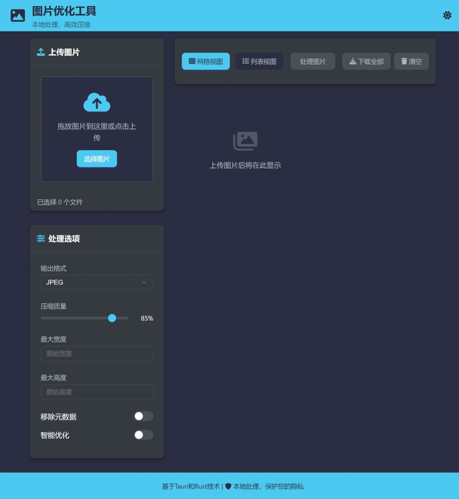

# 图像压缩工具

一个高效的跨平台图像处理应用，使用Tauri框架构建，支持批量压缩和优化图像。



## 主要功能

- **智能压缩**：基于图像内容自动选择最佳压缩参数
- **批量处理**：同时处理多张图片，提高工作效率
- **格式转换**：支持JPEG、PNG、WebP等格式之间的转换
- **元数据移除**：保护隐私，移除图片中的EXIF等元数据
- **自定义调整**：可自定义调整图像质量、尺寸等参数
- **实时预览**：处理前后对比，直观查看压缩效果
- **丰富的界面模式**：支持列表视图和网格视图

## 技术栈

- **前端**：HTML, CSS, JavaScript（原生）
- **后端**：Rust + Tauri
- **图像处理**：Rust image库
- **并行处理**：rayon并行计算库

## 安装

### 下载预编译版本

从[发布页面](https://github.com/yourusername/image-compressor/releases)下载适合您操作系统的安装包。

### 从源码构建

1. 确保已安装最新版本的[Rust](https://www.rust-lang.org/tools/install)和[Node.js](https://nodejs.org/)

2. 安装Tauri CLI
   ```bash
   cargo install tauri-cli
   ```

3. 克隆仓库
   ```bash
   git clone https://github.com/yourusername/image-compressor.git
   cd image-compressor
   ```

4. 构建应用
   ```bash
   cargo tauri build
   ```

## 开发指南

### 设置开发环境

1. 安装依赖
   ```bash
   cargo tauri dev
   ```

2. 启动开发服务器
   ```bash
   cargo tauri dev
   ```

### 项目结构
